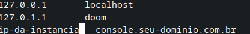

# Solução em Ansible para o Deploy do MinIO
Deployment automatizado do MinIO versão: 20240315010719.0.0

## Pre-requisitos:
* Ansible
* Instancia Ubuntu (Capacidade da instancia depende do ambiente "teste ou produção" para produção aconselho VM's com pelo menos 4 cpus e 8 de ram)

## Clone o projeto
```bash
git clone git@github.com:erlant-farias/minio-ansible.git
```
## Acesse o diretorio:

```bash
cd minio-ansible
```
## Alterações necessarias:

* Arquivo playbook.yml

    Altere o usuario que esta como 'ubuntu' para um usuario de sua instancia, com permissão de sudo.

* Arquivo hosts
    
    Substitua o texto ip-da-instancia pelo IP real da instancia

* Arquivo roles/config-minio/vars/main
    Substitua os campos por seus dados:
    ```
    minioadmin: minioadmin
    root_pass: troque-o-password
    url_padrao: console.exemplo.com.br
    ```
* No Path roles/config-pre-minio/files coloque seu certificado wildcard (caso queira ativar o ssl) substituindo os arquivos de exemplo (mesmo nome).

* No Path roles/config-minio/templates/minio.j2 caso queira o ssl altere a linha:
    ```
    MINIO_SERVER_URL="http://{{ url_padrao }}:9000"
    ```
    Para
    ```
    MINIO_SERVER_URL="https://{{ url_padrao }}:9000"
    ```
* Coloque as mesma credenciais (configuradas anteriormente) no path roles/install-mc/vars/main.yml
    ```
    minioadmin: minioadmin
    root_pass: troque-o-password
    ```

## Showtime

Basicamente agora basta rodar o comando do ansible-playbook e a magica irá acontecer. No diretorio minio-ansible execute o comando:

```bash
ansible-playbook -i hosts playbook.yml -u ubuntu --private-key=~/.ssh/id_rsa
```

## Dica (ambiente de teste)
Caso você esteja testando em uma vm, adicione uma linha no seu arquivo /etc/hosts como o ip e seu dominio para que possa resolver o nome.




## Dica para configuração do Proxy reverso (Nginx):

Você deve criar dois arquivos de configuração, um para o console e outro para a interface web:

* Exemplo de configuração para a interface web:

```
server {
   listen 443 ssl;
   listen [::]:443 ssl;
   include CERTIFICADO-SSL
   server_name minio.seu-dominio.com.br;
   access_log /var/log/nginx/minio-access.log;
   error_log /var/log/nginx/minio-error.log;
#   modsecurity on;
#   modsecurity_rules_file /etc/nginx/modsecurity.conf;  

   # Allow special characters in headers
   ignore_invalid_headers off;
   # Allow any size file to be uploaded.
   # Set to a value such as 1000m; to restrict file size to a specific value
   client_max_body_size 0;
   # Disable buffering
   proxy_buffering off;
   proxy_request_buffering off;

   location / {
      proxy_set_header Host $http_host;
      proxy_set_header X-Real-IP $remote_addr;
      proxy_set_header X-Forwarded-For $proxy_add_x_forwarded_for;
      proxy_set_header X-Forwarded-Proto $scheme;
      proxy_set_header X-NginX-Proxy true;

      # This is necessary to pass the correct IP to be hashed
      real_ip_header X-Real-IP;

      proxy_connect_timeout 300;

      # To support websocket
      proxy_http_version 1.1;
      proxy_set_header Upgrade $http_upgrade;
      proxy_set_header Connection "upgrade";

      chunked_transfer_encoding off;

      proxy_pass http://IP-DO-SERVIDOR:9001/; # This uses the upstream directive definition to load balance
   }
}
```

* Exemplo de configuração para o Console (api):

```
server {
   listen 443 ssl;
   listen [::]:443 ssl;
   include CERTIFICADO-SSL
   server_name console.seu-dominio.com.br;
   access_log /var/log/nginx/console-minio-access.log;
   error_log /var/log/nginx/console-minio-error.log;
#   modsecurity on;
#   modsecurity_rules_file /etc/nginx/modsecurity.conf; 
   # Allow special characters in headers
   ignore_invalid_headers off;
   # Allow any size file to be uploaded.
   # Set to a value such as 1000m; to restrict file size to a specific value
   client_max_body_size 0;
   # Disable buffering
   proxy_buffering off;
   proxy_request_buffering off;

   location / {
      proxy_set_header Host $http_host;
      proxy_set_header X-Real-IP $remote_addr;
      proxy_set_header X-Forwarded-For $proxy_add_x_forwarded_for;
      proxy_set_header X-Forwarded-Proto $scheme;

      proxy_connect_timeout 300;
      # Default is HTTP/1, keepalive is only enabled in HTTP/1.1
      proxy_http_version 1.1;
      proxy_set_header Connection "";
      chunked_transfer_encoding off;

      proxy_pass http://IP-DO-SERVIDOR:9000; # This uses the upstream directive definition to load balance
   }
}
server {
   listen 9000 ssl;
   listen [::]:9000 ssl;
   include CERTIFICADO-SSL
   server_name console.seu-dominio.com.br;
#   modsecurity on;
#   modsecurity_rules_file /etc/nginx/modsecurity.conf;
   # Allow special characters in headers
   ignore_invalid_headers off;
   # Allow any size file to be uploaded.
   # Set to a value such as 1000m; to restrict file size to a specific value
   client_max_body_size 0;
   # Disable buffering
   proxy_buffering off;
   proxy_request_buffering off;

   location / {
      proxy_set_header Host $http_host;
      proxy_set_header X-Real-IP $remote_addr;
      proxy_set_header X-Forwarded-For $proxy_add_x_forwarded_for;
      proxy_set_header X-Forwarded-Proto $scheme;

      proxy_connect_timeout 300;
      # Default is HTTP/1, keepalive is only enabled in HTTP/1.1
      proxy_http_version 1.1;
      proxy_set_header Connection "";
      chunked_transfer_encoding off;

      proxy_pass http://IP-DO-SERVIDOR:9000; # This uses the upstream directive definition to load balance
   }
}
```